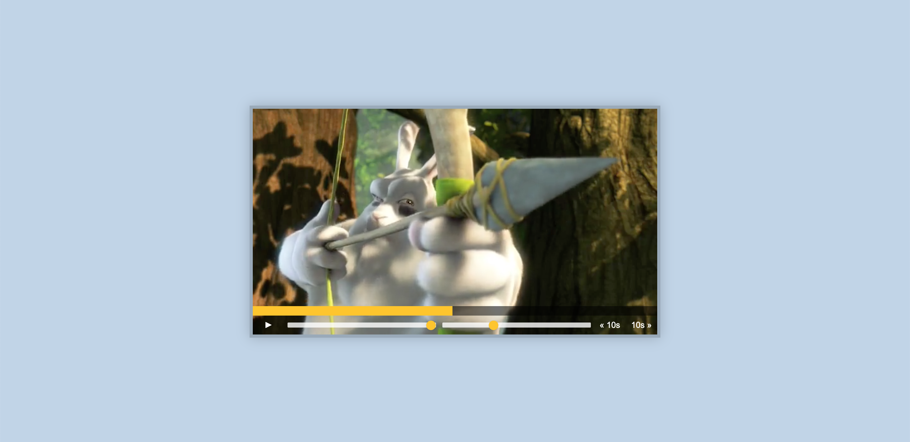

# Custom HTML5 Video Player: Vanilla JS

## Table of Contents

- [Description](#description)
- [Usage](#usage)
- [Credits](#credits)
- [License](#license)

## Description

A video player with custom built controls to scrub, skip, speed up, adjust sound, and play/pause. Created with only Vanilla JavaScript.

## Usage

## Credits

Wes Bos's Vanilla JavaScript 30 Day Challenge
https://javascript30.com/

## License

No licenses (default copyright laws apply).

---
